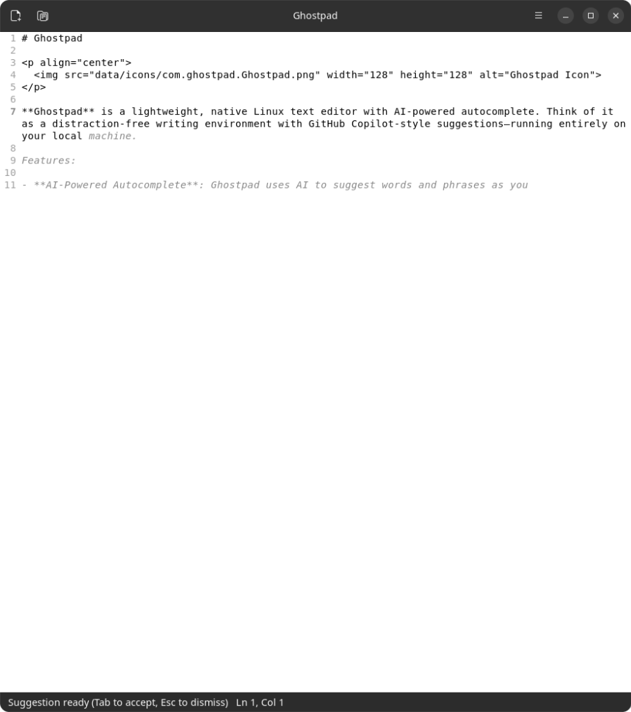

# Wispnote

<p align="center">
  
</p>

**Wispnote** is a lightweight, native Linux text editor with AI-powered autocomplete. Think of it as a distraction-free writing environment with GitHub Copilot-style suggestions—running entirely on your local machine.

## ✨ Features

- **Local LLM Autocomplete** – Get intelligent text completions powered by local GGUF models. No cloud required, no data leaves your machine.
- **Fill-in-the-Middle (FIM)** – Smart completions that understand context before AND after your cursor.
- **Native Linux Experience** – Built with GTK4 and libadwaita, respects your desktop theme (GNOME, KDE, XFCE).
- **Fast & Lightweight** – Rust-based core for speed and low memory footprint.
- **Distraction-Free** – Clean, minimal interface focused on writing.
- **Autosave & Recovery** – Never lose your work with automatic backups and crash recovery.
- **GPU Accelerated** – Supports Vulkan, CUDA, and ROCm for fast inference. Falls back to CPU when needed.

## 🖼️ Screenshot

<p align="center">
  
</p>

*Ghost text suggestions appear in gray italics as you type*

## 📦 Installation

### From Source (Recommended for Alpha)

**Prerequisites:**
- Rust 1.70+ (install via [rustup](https://rustup.rs/))
- GTK4 development libraries
- libadwaita development libraries
- Vulkan SDK (optional, for GPU acceleration)

**Ubuntu/Debian:**
```bash
sudo apt install libgtk-4-dev libadwaita-1-dev libgtksourceview-5-dev
```

**Fedora:**
```bash
sudo dnf install gtk4-devel libadwaita-devel gtksourceview5-devel
```

**Arch Linux:**
```bash
sudo pacman -S gtk4 libadwaita gtksourceview5
```

**Build & Run:**
```bash
git clone https://github.com/Daxiongmao87/wispnote.git
cd wispnote
cargo build --release
./target/release/wispnote
```

### AppImage

Download the latest AppImage from the [Releases](https://github.com/Daxiongmao87/wispnote/releases) page.

### Flatpak

*Coming soon*

## 🚀 Quick Start

1. **Launch Wispnote** and start typing
2. **Wait for suggestions** – Ghost text appears after a brief pause
3. **Press Tab** to accept a suggestion, **Esc** to dismiss
4. **Ctrl+Space** for manual completion trigger

### LLM Configuration

On first run, Wispnote will download a default model (~800MB). You can configure:
- **Preferences → LLM** to change models or endpoints
- GPU vs CPU inference
- Max tokens and other parameters

## ⌨️ Keyboard Shortcuts

| Action | Shortcut |
|--------|----------|
| New Document | Ctrl+N |
| Open File | Ctrl+O |
| Save | Ctrl+S |
| Save As | Ctrl+Shift+S |
| Find | Ctrl+F |
| Find & Replace | Ctrl+H |
| Accept Completion | Tab |
| Dismiss Completion | Esc |
| Manual Completion | Ctrl+Space |
| Preferences | Ctrl+, |

## 🔧 Configuration

Wispnote stores its configuration in standard XDG directories:
- Config: `~/.config/wispnote/`
- Data (models): `~/.local/share/wispnote/models/`
- State (autosave): `~/.local/state/wispnote/`

## 🤝 Contributing

Contributions are welcome! Please feel free to submit issues and pull requests.

## 📄 License

This project is open source and available under the [MIT License](LICENSE).

## 🙏 Acknowledgments

- Built with [GTK4](https://gtk.org/) and [libadwaita](https://gnome.pages.gitlab.gnome.org/libadwaita/)
- LLM inference powered by [llama.cpp](https://github.com/ggerganov/llama.cpp) via [llama-cpp-2](https://crates.io/crates/llama-cpp-2)
- Default model: [DeepSeek Coder](https://huggingface.co/deepseek-ai/deepseek-coder-1.3b-instruct)

---

**⚠️ Alpha Software** – This is early-stage software. Expect bugs and missing features. Please report issues on GitHub!
